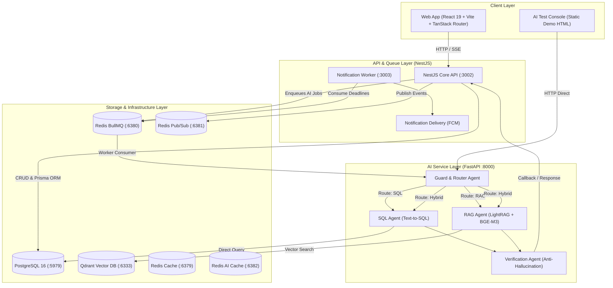

<div align="center">

# 📦 One61 RAG Monorepo
### Enterprise Multi-Agent AI & Logistics • Smart Calendar & Task Management

[](https://turbo.build/)
[](https://react.dev/)
[](https://nestjs.com/)
[](https://fastapi.tiangolo.com/)
[](https://python.org)
[](https://www.postgresql.org/)
[](https://qdrant.tech/)
[](https://redis.io/)
[](https://tailwindcss.com/)

<p align="center">
  Hệ thống quản lý lịch trình cá nhân hóa, tự động hóa thông báo đa kênh kết hợp <b>Agentic Multi-Agent RAG</b> chuyên biệt cho lĩnh vực Kho bãi, Vận chuyển & Chuỗi cung ứng (Logistics & Supply Chain).
</p>

</div>

---

## 📑 Mục lục

- [1. Giới thiệu tổng quan](#1-giới-thiệu-tổng-quan)
- [2. Kiến trúc hệ thống](#2-kiến-trúc-hệ-thống)
- [3. Cấu trúc thư mục Monorepo](#3-cấu-trúc-thư-mục-monorepo)
- [4. Yêu cầu môi trường](#4-yêu-cầu-môi-trường)
- [5. Hướng dẫn cài đặt & Khởi chạy từng bước](#5-hướng-dẫn-cài-đặt--khởi-chạy-từng-bước)
- [6. Cổng dịch vụ & Danh sách Endpoints](#6-cổng-dịch-vụ--danh-sách-endpoints)
- [7. Cơ chế hoạt động của AI Multi-Agent Pipeline](#7-cơ-chế-hoạt-động-của-ai-multi-agent-pipeline)
- [8. Danh sách lệnh thường dùng (Scripts Reference)](#8-danh-sách-lệnh-thường-dùng-scripts-reference)
- [9. Phát triển giao diện UI (Shadcn UI)](#9-phát-triển-giao-diện-ui-shadcn-ui)
- [10. Xử lý sự cố thường gặp (Troubleshooting)](#10-xử-lý-sự-cố-thường-gặp-troubleshooting)

---

## 1. Giới thiệu tổng quan

**One61 RAG** là monorepo toàn diện phục vụ 2 bài toán lớn:

1. **Personalized Calendar & Task Planner**: Quản lý lịch biểu công việc, phân tích nhịp sinh học năng lượng (energy alignment), cảnh báo rủi ro trễ deadline, hỗ trợ kéo thả trực quan (Pragmatic Drag-and-Drop) và thông báo đẩy đa kênh (Web Push FCM, In-app).
2. **Domain-Specific Agentic RAG (Logistics & Warehouse)**: Trợ lý AI đa tác nhân có khả năng tự động phân luồng (Guard & Router), tạo truy vấn SQL tự động (Text-to-SQL) tra cứu trực tiếp dữ liệu kho/vận đơn (`TRK...`, `ORD...`, `DEL...`, `FL...`, `DMG...`), kết hợp trích xuất tri thức từ tài liệu chính sách & quy trình SOP (LightRAG Knowledge Graph + Qdrant Vector Search) và xác minh sự thật chống ảo giác (Anti-Hallucination Verification Agent).

---

## 2. Kiến trúc hệ thống



---

## 3. Cấu trúc thư mục Monorepo

```text
one61-rag/
├── frontend/                     # Web Client (React 19, Vite, TanStack Router & Query, Tailwind CSS v4)
├── backend/
│   ├── ai/                       # FastAPI AI Service: Multi-agent, LightRAG, Qdrant, BullMQ worker
│   │   ├── src/agents/           # Guard, Router, SQL, RAG, Verification Agent
│   │   ├── src/rag/              # LightRAG engine, BGE-M3 embeddings, parser, chunker
│   │   ├── src/cache/            # Semantic Redis Cache
│   │   ├── src/memory/           # Conversation Memory & Auto-summarizer
│   │   └── data/                 # Datasets kho, packing slips, deliveries, extracted JSONs
│   ├── api/                      # NestJS REST & SSE API (Auth, Chat, Events, Tasks, SSE)
│   ├── notification-worker/      # BullMQ queue consumer xử lý lịch hẹn & reminder
│   └── notification-delivery/    # Service gửi thông báo qua Firebase Cloud Messaging (FCM)
├── packages/                     # Thư viện dùng chung (Shared Packages)
│   ├── constants/                # Enums, mã lỗi, định danh dùng chung
│   ├── database/                 # Prisma Schema, migrations và database client
│   ├── env/                      # Zod validation cho biến môi trường
│   ├── infra-redis/              # Redis Client cấu hình sẵn (Cache, BullMQ, PubSub)
│   ├── logger/                   # Shared Logger module
│   ├── typescript-config/        # TSConfig dùng chung cho các package
│   └── ui/                       # Design System: Shadcn UI components, Tailwind tokens
├── docker/                       # Dockerfiles cho Web & API
├── docker-compose.yml            # Infra stack: PostgreSQL + 3 Redis instances
├── docker-compose.apps.yml       # Production app stack: NestJS API + Web Nginx
├── docs/                         # Tài liệu thiết kế Database & Dashboard
├── turbo.json                    # Cấu hình Turborepo pipeline
└── package.json                  # Cấu hình root workspace (pnpm)
```

---

## 4. Yêu cầu môi trường

Trước khi bắt đầu, hãy đảm bảo máy tính của bạn đã cài đặt:

- **Node.js**: Phiên bản `>= 20.x`
- **pnpm**: Phiên bản `>= 9.x` (`npm install -g pnpm`)
- **Python**: Phiên bản `>= 3.11`
- **uv**: Trình quản lý package Python siêu tốc (`pip install uv` hoặc [cài uv](https://github.com/astral-sh/uv))
- **Docker & Docker Compose**: Để chạy toàn bộ hạ tầng cơ sở dữ liệu và cache

---

## 5. Hướng dẫn cài đặt & Khởi chạy từng bước

### Bước 1: Clone repo và cấu hình môi trường

Tạo các file `.env` từ file mẫu:

```bash
# 1. Cấu hình biến môi trường Root (Node backend + infra)
cp .env.example .env

# 2. Cấu hình biến môi trường AI Service
cp backend/ai/.env.example backend/ai/.env
```

> **Lưu ý cấu hình AI Service (`backend/ai/.env`)**:
> - Điền `GEMINI_API_KEY` (lấy từ [Google AI Studio](https://aistudio.google.com/apikey)) hoặc `GROQ_API_KEYS`.
> - Mặc định AI Service sử dụng model `gemini-2.5-flash` và `gemini-2.5-flash-lite`.

---

### Bước 2: Khởi động cơ sở hạ tầng (Database & Redis)

Khởi chạy PostgreSQL và các cụm Redis qua Docker:

```bash
docker compose up -d
```

Để chạy thêm cụm **Qdrant Vector DB** và **AI Redis Cache** cho AI Service:

```bash
cd backend/ai
docker compose up -d qdrant redis
cd ../..
```

Kiểm tra xem các container đã chạy ổn định (`healthy`):
```bash
docker ps
```

---

### Bước 3: Cài đặt dependencies

Cài đặt toàn bộ packages cho frontend, backend và workspace:

```bash
# Cài đặt Node dependencies
pnpm install

# Cài đặt Python dependencies cho AI Service
cd backend/ai
uv sync --extra dev
cd ../..
```

---

### Bước 4: Tạo Prisma Client & Chạy Migrations

Khởi tạo cấu trúc cơ sở dữ liệu PostgreSQL cho NestJS API:

```bash
pnpm db:generate
pnpm db:migrate:dev
```

---

### Bước 5: Khởi chạy các ứng dụng trong chế độ Development

Bạn có thể chạy linh hoạt từng dịch vụ hoặc chạy song song:

#### Cách 1: Chạy Frontend và NestJS API (Phổ biến nhất)
```bash
pnpm dev
```
- **Frontend** chạy tại: `http://localhost:5173`
- **NestJS API** chạy tại: `http://localhost:3002`

#### Cách 2: Chạy riêng AI Service (Python FastAPI)
Mở một terminal riêng:
```bash
pnpm dev:ai
```
- **AI Service API** chạy tại: `http://localhost:8000`
- **Giao diện Demo Chat & Test Document Upload**: `http://localhost:8000/demo`
- **Healthcheck**: `http://localhost:8000/health`

#### Cách 3: Chạy Notification Worker & Delivery
Mở một terminal riêng:
```bash
pnpm dev:notification
```

---

## 6. Cổng dịch vụ & Danh sách Endpoints

| Dịch vụ | Cổng (Port) | Địa chỉ / URL | Chức năng |
| :--- | :---: | :--- | :--- |
| **Frontend Web** | `5173` | `http://localhost:5173` | Giao diện Lịch, Task, Chat AI |
| **NestJS API** | `3002` | `http://localhost:3002` | REST API, SSE streaming, Auth, Chat |
| **AI FastAPI** | `8000` | `http://localhost:8000` | Agentic RAG Service |
| **AI Demo Web** | `8000` | `http://localhost:8000/demo` | Console test trực quan các Agents |
| **PostgreSQL** | `5979` | `localhost:5979` | DB lưu User, Events, Chat, Messages |
| **Redis Cache** | `6379` | `localhost:6379` | Cache dữ liệu hệ thống NestJS |
| **Redis BullMQ**| `6380` | `localhost:6380` | Hàng đợi tác vụ bất đồng bộ & AI Jobs |
| **Redis Pub/Sub**| `6381` | `localhost:6381` | Quản lý kết nối Real-time SSE |
| **Redis AI Cache**| `6382` | `localhost:6382` | Semantic Cache & Memory của AI Service |
| **Qdrant DB** | `6333` | `http://localhost:6333/dashboard` | Lưu trữ vector nhúng tài liệu chính sách |

---

## 7. Cơ chế hoạt động của AI Multi-Agent Pipeline

AI Service tích hợp luồng xử lý đa tác nhân tự động phân loại và phản hồi câu hỏi người dùng:

```text
User Request ──► [ Guard & Router Agent ]
                        │
       ┌────────────────┼────────────────┬────────────────┐
       ▼                ▼                ▼                ▼
 [ Direct Chat ]   [ SQL Agent ]   [ RAG Agent ]   [ Hybrid Agent ]
 (Chào hỏi/Ngoài   (Tra cứu mã đơn  (Hỏi quy trình,  (Kết hợp dữ liệu
   phạm vi)          TRK, ORD, FL...) SOP, chính sách) đơn & chính sách)
                        │                │                │
                        └────────────────┴────────────────┘
                                         ▼
                           [ Verification Agent ]
                           (Kiểm định chống ảo giác)
                                         ▼
                                   Final Output
```

1. **Guard & Router Agent**:
   - Kiểm tra an toàn, loại bỏ prompt injection.
   - Nhận diện thực thể: bóc tách chính xác mã `TRK...` (Tracking code), `ORD...` (Order code), `DEL...` (Delivery id), `FL...` (Flight manifest), `DMG...` (Damage report).
   - Định tuyến chuẩn xác tới nhánh `sql`, `rag`, `hybrid` hoặc phản hồi trực tiếp nếu ngoài phạm vi.
2. **Text-to-SQL Agent**:
   - Tự động sinh truy vấn SQL an toàn (chỉ cho phép `SELECT`, luôn kèm `LIMIT`, cấm `UPDATE/DELETE`).
   - Tận dụng các Views tối ưu: `v_shipment_journey`, `v_damage_summary`, `v_weight_discrepancy`.
3. **Knowledge Graph RAG Agent**:
   - Sử dụng **LightRAG** kết hợp vector database **Qdrant**.
   - Model nhúng đa ngôn ngữ mạnh mẽ `BAAI/bge-m3` (1024 chiều).
   - Suy luận 6 bước bắt buộc (`<thinking>`: Intent → Scan → Extract → Cross-Ref → Verify → Compose).
4. **Anti-Hallucination Verification Agent**:
   - Bóc tách câu trả lời thành từng claims độc lập.
   - Đối chiếu lại với dữ liệu nguồn/context (`SUPPORTED`, `IMPLIED`, `WEAK`, `UNSUPPORTED`).
   - Đảm bảo điểm tin cậy `overall_groundedness >= 0.7`. Nếu có nghi ngờ sẽ tự động chèn disclaimer hoặc từ chối phản hồi sai lệch.

---

## 8. Danh sách lệnh thường dùng (Scripts Reference)

Tất cả các lệnh được điều phối tập trung qua Turborepo tại thư mục gốc:

```bash
# === PHÁT TRIỂN (DEVELOPMENT) ===
pnpm dev                 # Chạy song song Frontend và NestJS API
pnpm dev:frontend        # Chỉ chạy Frontend (Vite)
pnpm dev:api             # Chỉ chạy NestJS API
pnpm dev:ai              # Chạy FastAPI AI Service (FastAPI uvicorn)
pnpm dev:notification   # Chạy Notification Worker & Delivery

# === DATABASE & PRISMA ===
pnpm db:generate         # Tạo lại Prisma client từ schema.prisma
pnpm db:migrate:dev      # Tạo & áp dụng migration mới vào PostgreSQL
pnpm db:migrate:reset    # Reset toàn bộ cơ sở dữ liệu về mặc định

# === KIỂM TRA CHẤT LƯỢNG CODE & BUILD ===
pnpm build               # Build toàn bộ các dự án trong workspace
pnpm lint                # Kiểm tra lỗi linter toàn bộ dự án
pnpm lint:biome          # Kiểm tra lint bằng Biome
pnpm format              # Format code toàn bộ workspace bằng Biome
pnpm typecheck           # Kiểm tra kiểu dữ liệu TypeScript (tsc --noEmit)
```

---

## 9. Phát triển giao diện UI (Shadcn UI)

Các UI component dùng chung được đặt trong `packages/ui` để chia sẻ giữa các frontend modules.

### Thêm component mới:
```bash
pnpm dlx shadcn@latest add <component-name> -c packages/ui
```
*Ví dụ: `pnpm dlx shadcn@latest add dialog -c packages/ui`*

### Sử dụng component trong Frontend:
Import trực tiếp từ `@aqua-calendar/ui`:

```tsx
import { Button } from "@aqua-calendar/ui/components/button";
import { Dialog, DialogContent, DialogTrigger } from "@aqua-calendar/ui/components/dialog";
```

---

## 10. Xử lý sự cố thường gặp (Troubleshooting)

### 1. Lỗi cổng PostgreSQL bị chiếm dụng (`Port 5979 is already allocated`)
Cổng mặc định của PostgreSQL trong dự án là `5979`. Nếu bị trùng, hãy đổi giá trị `POSTGRES_PORT` trong file `.env` và cập nhật lại chuỗi kết nối `DATABASE_URL`.

### 2. AI Service khởi động lần đầu bị chậm
Model nhúng `BAAI/bge-m3` có dung lượng khoảng ~2.2GB. Trong lần chạy đầu tiên, hệ thống sẽ tự động tải model từ HuggingFace về máy cache. Các lần khởi động sau sẽ được preload nhanh chóng trong bộ nhớ.

### 3. Lỗi xác thực Redis (`NOAUTH Authentication required`)
Các container Redis được thiết lập mật khẩu mặc định là `password`. Đảm bảo các biến `REDIS_CACHE_PASS`, `REDIS_BULLMQ_PASS`, `REDIS_PUB_SUB_PASS` trong file `.env` khớp với thiết lập trong file `docker-compose.yml`.

### 4. Lỗi Prisma Client sau khi thay đổi schema
Mỗi khi bạn chỉnh sửa file `packages/database/prisma/schema.prisma`, hãy luôn chạy:
```bash
pnpm db:generate
```
để các workspace cập nhật TypeScript typings tương ứng.

---

<div align="center">
  <sub>One61 RAG • Built for Hackathon & Enterprise Logistics Intelligence</sub>
</div>
