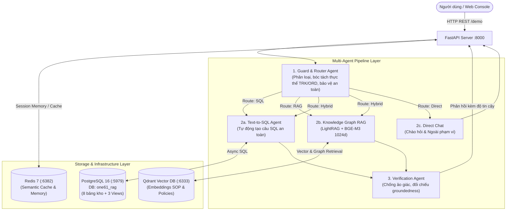

<div align="center">

# 📦 One61 RAG — Domain-Specific Multi-Agent AI Service
### Enterprise Logistics & Supply Chain Intelligent Assistant

[](https://python.org)
[](https://fastapi.tiangolo.com/)
[](https://aistudio.google.com/)
[](https://qdrant.tech/)
[](https://www.postgresql.org/)
[](https://redis.io/)
[](https://github.com/astral-sh/uv)

<p align="center">
  Hệ thống <b>Agentic Multi-Agent RAG</b> chuyên biệt cho lĩnh vực Vận chuyển, Kho bãi & Chuỗi cung ứng (Logistics). Tích hợp khả năng tự động phân luồng, sinh truy vấn SQL tra cứu dữ liệu thời gian thực, trích xuất đồ thị tri thức (Knowledge Graph) từ quy trình SOP và kiểm định chống ảo giác (Anti-Hallucination).
</p>

[📘 Xem Hướng Dẫn Khởi Chạy Chi Tiết](docs/HUONG_DAN_CHAY_DU_AN.md) • [🌐 Trải Nghiệm Web Demo Console](#-giao-di%E1%BB%87n-web-demo-console) • [📡 Danh Sách API](#-danh-s%C3%A1ch-api-ch%C3%ADnh)

</div>

---

## 📑 Mục lục
1. [Tổng quan kiến trúc hệ thống](#-t%E1%BB%95ng-quan-ki%E1%BA%BFn-tr%C3%BAc-h%E1%BB%87-th%E1%BB%91ng)
2. [Cơ chế hoạt động của Multi-Agent Pipeline](#-c%C6%A1-ch%E1%BA%BF-ho%E1%BA%A1t-%C4%91%E1%BB%99ng-c%E1%BB%A7a-multi-agent-pipeline)
3. [Cấu trúc thư mục](#-c%E1%BA%A5u-tr%C3%BAc-th%C6%B0-m%E1%BB%A5c)
4. [Cơ sở dữ liệu & Mô hình dữ liệu](#-c%C6%A1-s%E1%BB%9F-d%E1%BB%AF-li%E1%BB%87u--m%C3%B4-h%C3%ACnh-d%E1%BB%AF-li%E1%BB%87u)
5. [Khởi chạy nhanh trong 3 bước](#-kh%E1%BB%9Fi-ch%E1%BA%A1y-nhanh-trong-3-b%C6%B0%E1%BB%9Bc)
6. [Giao diện Web Demo Console](#-giao-di%E1%BB%87n-web-demo-console)
7. [Danh sách API chính](#-danh-s%C3%A1ch-api-ch%C3%ADnh)
8. [Các câu hỏi mẫu để kiểm thử](#-c%C3%A1c-c%C3%A2u-h%E1%BB%8Fi-m%E1%BA%ABu-%C4%91%E1%BB%83-ki%E1%BB%83m-th%E1%BB%AD)

---

## 🏛️ Tổng quan kiến trúc hệ thống



---

## 🤖 Cơ chế hoạt động của Multi-Agent Pipeline

1. **Guard & Router Agent**:
   - Kiểm tra an toàn, loại bỏ prompt injection độc hại.
   - Bóc tách thực thể mã vận đơn, mã đơn hàng (`TRK...`, `ORD...`, `DEL...`, `FL...`, `DMG...`).
   - Định tuyến thông minh sang nhánh phù hợp: `sql` (tra cứu đơn/hàng hỏng/chuyến bay), `rag` (hỏi quy trình, chính sách bồi thường), `hybrid` (kết hợp cả hai) hoặc `direct` (chào hỏi xã giao).
2. **Text-to-SQL Agent**:
   - Tự động sinh truy vấn PostgreSQL chuẩn xác, chỉ cho phép `SELECT`, kèm `LIMIT`, tuyệt đối không thay đổi dữ liệu.
   - Tận dụng các Views tối ưu: `v_shipment_journey` (hành trình vận chuyển), `v_damage_summary` (hàng hư hỏng), `v_weight_discrepancy` (chênh lệch khối lượng cước).
3. **Knowledge Graph RAG Agent (LightRAG + BGE-M3 + Qdrant)**:
   - Sử dụng model nhúng mạnh mẽ đa ngôn ngữ `BAAI/bge-m3` (1024 chiều).
   - Truy vấn kết hợp Vector Search và Knowledge Graph (thực thể, mối quan hệ giữa các điều khoản chính sách SOP).
4. **Anti-Hallucination Verification Agent**:
   - Tách các luận điểm (claims) trong câu trả lời và đối chiếu ngược lại với context thực tế.
   - Chấm điểm `groundedness_score`. Nếu điểm không đạt ngưỡng an toàn, hệ thống tự động gắn disclaimer cảnh báo hoặc điều chỉnh câu trả lời để chống ảo giác.

---

## 📁 Cấu trúc thư mục

```text
one61-rag/
├── src/                          # Mã nguồn ứng dụng AI Service
│   ├── agents/                   # Các Agents: Guard, Router, SQL, RAG, Verification
│   ├── rag/                      # Engine LightRAG, embeddings BGE-M3, chunker
│   ├── cache/                    # Redis Semantic Cache (cosine similarity lookup)
│   ├── memory/                   # Conversation Memory & tóm tắt ngữ cảnh
│   ├── db/                       # Kết nối Async Postgres cho Warehouse DB
│   ├── llm/                      # Connector Google GenAI (Gemini 3.8 Flash, 3.5 Flash Lite)
│   ├── static/                   # Giao diện Web Console có sẵn (demo.html)
│   ├── schemas/                  # Pydantic schemas (Request, Response, Internal)
│   └── main.py                   # FastAPI Application & API endpoints
├── data/                         # Dữ liệu tài liệu & extracted JSONs
│   ├── extracted/                # Dữ liệu vận đơn, giao hàng, tờ khai, hàng hỏng
│   └── lightrag_storage/         # Bộ nhớ cục bộ đồ thị tri thức LightRAG
├── pegaxus-document/             # Kho tài liệu Pháp lý, Hải quan & Kiểm dịch vận chuyển ngựa (EU/UK specs, AHL, BCP, EC 1/2005)
│   ├── legal_framework/          # Quy chuẩn pháp lý Châu Âu/Anh, ma trận chứng từ theo cặp quốc gia
│   └── compliance_and_sop/       # Quy trình SOP kiểm soát phúc lợi, trạm dừng, nghiệm thu và xử lý sự cố biên giới
├── scripts/                      # Bộ scripts hỗ trợ
│   ├── import_warehouse_to_postgres.py # Nạp 55.000+ dòng dữ liệu vào database one61_rag
│   ├── ingest_pegaxus.py         # Nạp tài liệu vận chuyển ngựa Pegaxus vào LightRAG
│   ├── sql/warehouse_schema.sql  # DDL khởi tạo 8 bảng và 3 views tối ưu
│   └── preprocess/               # Scripts tiền xử lý OCR, trích xuất PDF/CSV
├── docs/                         # Tài liệu dự án
│   └── HUONG_DAN_CHAY_DU_AN.md   # Cẩm nang cài đặt & khởi chạy chi tiết từng bước
├── docker-compose.yml            # Docker stack: Qdrant (:6333), Redis (:6382), Postgres (:5979)
├── pyproject.toml                # Quản lý dependencies với uv
└── .env                          # Biến môi trường & API Key
```

---

## 🗄️ Cơ sở dữ liệu & Mô hình dữ liệu

Hệ thống sử dụng cơ sở dữ liệu PostgreSQL **`one61_rag`** (port `5979`) gồm 8 bảng dữ liệu tác nghiệp thực tế:

| Tên bảng / View | Số lượng bản ghi | Mục đích sử dụng |
| :--- | :---: | :--- |
| `deliveries` | **8,664** đơn | Lịch sử giao hàng nội địa (`DEL...`, `TRK...`), trạng thái giao, cước phí |
| `manifest_packages` | **40,245** kiện | Danh mục kiện hàng trên các chuyến bay quốc tế |
| `customs_items` | **5,240** mục | Chi tiết hàng hóa trong tờ khai hải quan, thuế suất |
| `flight_manifests` | **400** chuyến | Lược khai chuyến bay (`FL...`), sân bay xuất/nhập, giờ bay, độ trễ |
| `repacking_logs` | **600** lượt | Nhật ký đóng gói lại kiện hàng, nhân viên, chi phí repack |
| `packing_slips` | **500** phiếu | Phiếu đóng gói, thông số kích thước hộp, vật liệu, kiểm định QC |
| `damage_reports` | **120** biên bản | Báo cáo sự cố hư hỏng hàng (`DMG...`), mức độ và điều kiện bồi thường |
| `customs_declarations` | **60** tờ khai | Tờ khai hải quan nhập khẩu |
| `v_shipment_journey` | *View tổng hợp* | Ghép nối hành trình: Đóng gói ➔ Bay ➔ Hải quan ➔ Giao hàng nội địa |
| `v_damage_summary` | *View tổng hợp* | Báo cáo tổng hợp hàng hư hại kèm trạng thái giao và bảo hiểm |
| `v_weight_discrepancy` | *View tổng hợp* | So sánh khối lượng thực tế và khối lượng thể tích tính cước |

---

## ⚡ Khởi chạy nhanh trong 3 bước

> 💡 Xem hướng dẫn chi tiết từng bước tại: [docs/HUONG_DAN_CHAY_DU_AN.md](docs/HUONG_DAN_CHAY_DU_AN.md)

### Bước 1: Khởi động cơ sở hạ tầng (Docker)
```powershell
docker compose up -d
```
*(Khởi động Qdrant Vector DB, Redis Cache và PostgreSQL `one61_rag`)*.

### Bước 2: Cài đặt thư viện Python (uv)
```powershell
uv sync --extra dev
```

### Bước 3: Chạy RAG Service
```powershell
uv run python -m src.main
```
* **Giao diện Web Demo**: [http://localhost:8000/demo](http://localhost:8000/demo)
* **API Endpoint**: [http://localhost:8000/api/chat](http://localhost:8000/api/chat)
* **Qdrant Dashboard**: [http://localhost:6333/dashboard](http://localhost:6333/dashboard)

---

## 🌐 Giao diện Web Demo Console

Dự án tích hợp sẵn giao diện trực quan tại **`http://localhost:8000/demo`**:

* **Interactive Multi-Agent Chat**: Trò chuyện trực tiếp với hệ thống AI.
* **Theo dõi luồng suy luận `<thinking>`**: Xem chi tiết từng bước Router Agent phân loại, SQL Agent tạo query, hay RAG Agent trích xuất tri thức.
* **Kiểm định chống ảo giác**: Hiển thị rõ điểm `confidence_score`, `groundedness_score`, và các claim được trích dẫn.
* **Tải lên tài liệu mới**: Hỗ trợ kéo thả file PDF, DOCX, TXT để RAG tự động phân tích và nhúng vào cơ sở dữ liệu Vector.

---

## 📡 Danh sách API chính

| Method | Endpoint | Tham số chính | Chức năng |
| :--- | :--- | :--- | :--- |
| `POST` | `/api/chat` | `{"message": "...", "mode": "fast"}` | Chat đồng bộ với Agent Pipeline (trả về kết quả, luồng suy luận & metadata) |
| `POST` | `/api/chat/async` | `{"conversationId": "...", "content": {...}}` | Nhận yêu cầu bất đồng bộ (trả 202 và gửi webhook khi xong) |
| `POST` | `/api/ingest` | `file: UploadFile` | Tải lên và nhúng tài liệu mới vào Qdrant Vector Store |
| `GET` | `/demo` | - | Giao diện Web Test Console |
| `GET` | `/health` | - | Kiểm tra trạng thái hệ thống, Qdrant và các model LLM |

---

## 💡 Các câu hỏi mẫu để kiểm thử

| Nhóm chức năng | Câu hỏi mẫu | Agent phụ trách |
| :--- | :--- | :---: |
| **Tra cứu đơn hàng** | *"Đơn hàng TRK0001617 hiện đang ở đâu?"* | `SQL Agent` |
| **Tra cứu hàng hư hỏng** | *"Kiểm tra biên bản hư hại của đơn hàng TRK0000003"* | `SQL Agent` |
| **Tra cứu chuyến bay** | *"Chuyến bay FL0001 có bao nhiêu kiện hàng và trạng thái thế nào?"* | `SQL Agent` |
| **Chính sách bồi thường** | *"Hàng hóa bị vỡ khi không mua bảo hiểm thì công ty đền bù như thế nào?"* | `RAG Agent` |
| **Quy trình kho SOP** | *"Quy trình đóng gói hàng dễ vỡ yêu cầu những vật tư gì?"* | `RAG Agent` |
| **Hỏi đáp kết hợp** | *"Đơn TRK0001617 của tôi bị trễ giao, theo chính sách thì tôi có được bồi thường cước không?"* | `Hybrid (SQL + RAG)` |
| **Chào hỏi** | *"Xin chào, bạn có thể giúp gì cho tôi?"* | `Direct Chat` |

---

<div align="center">
  <sub>One61 RAG • Multi-Agent AI System for Hackathon & Enterprise Logistics</sub>
</div>
